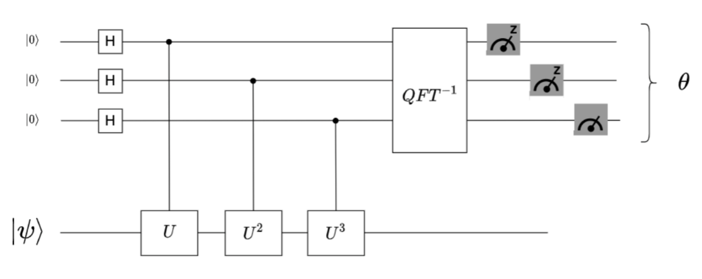

# Quantum Phase Estimation Lab

## Objectives

Apply acquired knowledge to implement the Quantum Phase Estimation (QPE) algorithm and determine the phase of a unitary operator $U$. This will be done using the QISKit development environment, Quantum Lab.

## Exercise:

QPE (Quantum Phase Estimation), also known as PEA (Phase Estimation Algorithm), is an algorithm that allows determining the eigenvalues of a unitary operator. It finds applications in various quantum computing problems and stands as one of the key subroutines in quantum computation.

The unitary condition of linear transformations applied to quantum states is a requirement of quantum mechanics. As the operator $U$ is unitary $(U^† U=I)$, its eigenvalues have a modulus of 1 and can be expressed in the form $e^{iθ}$, where $θ$ is the phase associated with the eigenvalue.

Since $θ∈[0,2π)$, we can represent θ as a fraction of 2π, i.e., $θ=θ' (2π)$, where $θ^∈[0,1)$. As $θ'$ is a decimal between 0 and 1, it can be represented as a binary fraction: $θ'=0.θ_1 θ_2 θ_3...θ_n$, where n is the desired precision.

The algorithm's general scheme involves using Phase Kickback to modify the phase of control qubits, storing the phase in the Fourier basis, and then applying the inverse Quantum Fourier Transform (QFT) to convert to the computational basis for measurement.

Some binary fractions examples:

- $1/4 = 0.25 ⇒ 0.010$
- $1/8 = 0.125 ⇒ 0.001$
- $1/6 = 0.1666... ⇒ 0.0010101...$
- $1/3 = 0.3333... ⇒ 0.01010101...$

The goal of this exercise is to accurately estimate the phase of the unitary operator $U$, which applies a rotation of $π⁄9$ around the Z-axis to the state $|1⟩:
U|1⟩=e^{(iπ/9)} |1⟩$

## Extension and Format

Include code solving the problem in the repository.
